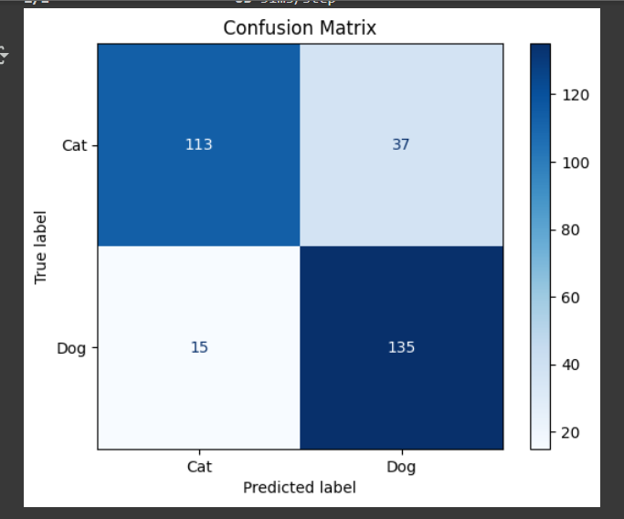

# 🐱🐶 Cat vs Dog Image Classifier

This project implements a Convolutional Neural Network (CNN) to classify images as either **cats** or **dogs**. Built and trained using **TensorFlow** and **Keras** in **Google Colab**, the model achieves a test accuracy of approximately **82.67%**.

---

## 📂 Dataset

The original dataset was sourced from the [Kaggle Dogs vs. Cats competition](https://www.kaggle.com/competitions/dogs-vs-cats). It was preprocessed into a structure suitable for TensorFlow’s `image_dataset_from_directory`:


A validation split of 20% was used from the training set.

---

## 🧠 Model Overview

The model uses a simple CNN with three convolutional layers and data augmentation:

- **Input:** 128x128 RGB images
- **Data Augmentation:**
  - Random flip (horizontal)
  - Random zoom
  - Random rotation
  - Random contrast
- **Layers:**
  - Conv2D (32) → ReLU → MaxPooling
  - Conv2D (64) → ReLU → MaxPooling
  - Conv2D (128) → ReLU → MaxPooling
  - Flatten → Dense(128) → Dropout(0.3)
  - Dense(1, activation='sigmoid') for binary output

---

## ⚙️ Training Details

- **Optimizer:** Adam  
- **Loss Function:** Binary Crossentropy  
- **Metrics:** Accuracy  
- **Epochs:** 10  
- **EarlyStopping:** Enabled with `patience=5` and `restore_best_weights=True`

---

## 📈 Evaluation

- **Test Accuracy:** **87.67%**
- **Evaluation Metrics:**
  - Accuracy on test set
  - Confusion Matrix

### 🔍 Confusion Matrix

The model’s predictions were evaluated using a confusion matrix:



- **True Positives:** Dogs correctly predicted  
- **True Negatives:** Cats correctly predicted  
- **False Positives:** Cats misclassified as dogs  
- **False Negatives:** Dogs misclassified as cats

---

## 🧪 Predicting Custom Images

### 🐱 Example: Predicting on a Cat Image  


```python
from tensorflow.keras.preprocessing import image
import tensorflow as tf

img = image.load_img("your_image.jpg", target_size=(128, 128))
img_array = tf.expand_dims(image.img_to_array(img), 0) / 255.0
prediction = model.predict(img_array)

if prediction >= 0.5:
    print("Dog")
else:
    print("Cat")
```

